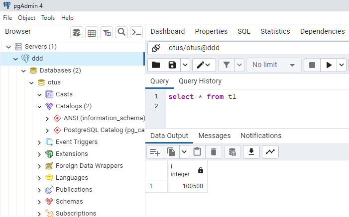

# ДЗ 02. Установка и настройка PostgteSQL в контейнере Docker

## GCP
Чтобы себе на Windows Google Cloud CLI не ставить, будем использовать админскую машинку в облаке google

- создаем у себя ключик ```ssh-keygen -t ed25519```
- вносим его в https://console.cloud.google.com/compute/metadata?tab=sshkeys и правим имя пользователя на будущее  
- создаем в GCP машинку ```vm-admin```
    - у админской виртуалки включить "Allow full access to all Cloud APIs" 

или в ```Cloud Shell```
```
# создаем машинку vm-admin
gcloud compute instances create vm-admin --zone=europe-north1-a --machine-type=e2-small --service-account=724511005767-compute@developer.gserviceaccount.com --scopes=https://www.googleapis.com/auth/cloud-platform
```

Дальше все действия с админской машинки - подключаемся ```ssh ae@x.x.x.x``` (ip-шник внешний посмотреть в Google Cloud Console)
```
# делаем машинку для игрищ с докером 
gcloud compute instances create vm-docker --zone=europe-north1-a --machine-type=e2-sm```all

# открыть порты 
gcloud compute --project=double-scholar-377612 firewall-rules create postgres-5432 --direction=INGRESS --priority=1000 --network=default --action=ALLOW --rules=all --source-ranges=0.0.0.0/0

gcloud compute ssh vm-docker
```

## Docker
Ставим в ```vm-docker``` Docker по иструкции https://docs.docker.com/engine/install/debian/
```
# либо единым куском 
sudo apt-get update
sudo apt-get install \
    ca-certificates \
    curl \
    gnupg \
    lsb-release
sudo mkdir -m 0755 -p /etc/apt/keyrings
curl -fsSL https://download.docker.com/linux/debian/gpg | sudo gpg --dearmor -o /etc/apt/keyrings/docker.gpg
echo \
  "deb [arch=$(dpkg --print-architecture) signed-by=/etc/apt/keyrings/docker.gpg] https://download.docker.com/linux/debian \
  $(lsb_release -cs) stable" | sudo tee /etc/apt/sources.list.d/docker.list > /dev/null
sudo apt-get update
sudo apt-get install docker-ce docker-ce-cli containerd.io docker-buildx-plugin docker-compose-plugin

# + docker-compose
sudo curl -SL https://github.com/docker/compose/releases/download/v2.16.0/docker-compose-linux-x86_64 -o /usr/local/bin/docker-compose
sudo chmod +x /usr/local/bin/docker-compose
sudo docker-compose version

# либо одной строчкой через скрипт (так еще еруче)
curl -fsSL https://get.docker.com -o get-docker.sh && sudo sh get-docker.sh && rm get-docker.sh && sudo usermod -aG docker $USER
```

## postgres & client docker 
Разворачиваем postgres и клиент 
```
sudo mkdir -p /var/lib/postgres/data

docker run --name postgres-server -p 5432:5432 -e POSTGRES_USER=otus -e POSTGRES_PASSWORD=otuspsw -d -v "/var/lib/postgres/data":/var/lib/postgresql/data postgres:14

sudo docker run -it --rm --name postgres-client postgres:14 psql -h 34.88.220.116 -U otus

psql (14.7 (Debian 14.7-1.pgdg110+1))
Type "help" for help.

otus=# create table t1 (i int);
CREATE TABLE
otus=# insert into t1 values (100500);
INSERT 0 1
otus=# \q
root@vm-docker:/home/ae# docker ps
CONTAINER ID   IMAGE         COMMAND                  CREATED              STATUS              PORTS                                       NAMES
7988c6b3db57   postgres:14   "docker-entrypoint.s…"   About a minute ago   Up About a minute   0.0.0.0:5432->5432/tcp, :::5432->5432/tcp   postgres-server
root@vm-docker:/home/ae# docker rm 7988c6b3db57 -f
7988c6b3db57
root@vm-docker:/home/ae# docker ps
CONTAINER ID   IMAGE     COMMAND   CREATED   STATUS    PORTS     NAMES
root@vm-docker:/home/ae# docker run --name postgres-server -p 5432:5432 -e POSTGRES_USER=otus -e POSTGRES_PASSWORD=otuspsw -d -v "/var/lib/postgres/data":/var/lib/postgresql/data postgres:14
28f91480a4f984009c4a56e9092eeb9a64fa5a14032c20ff731513dab83df77f
root@vm-docker:/home/ae# sudo docker run -it --rm --name postgres-client postgres:14 psql -h 34.88.220.116 -U otus
Password for user otus:
psql (14.7 (Debian 14.7-1.pgdg110+1))
Type "help" for help.

otus=# select * from t1;
   i
--------
 100500
(1 row)

otus=#
```
Всё на месте

Подключаюсь издалека - тоже всё норм:



## Вопросики? 
Не сработало почему-то такое перенаправление папок если не до папки data:

```docker run --name postgres-server -p 5432:5432 -e POSTGRES_USER=otus -e POSTGRES_PASSWORD=otuspsw -d -v "/var/lib/postgres":/var/lib/postgresql postgres:14```


## Разное-полезное
- Статья про параметры docker образа postgres https://habr.com/ru/post/578744/

- можно сделать docker-сеть и коннектиться по именам:
    ```
    sudo docker network create pg-net

    sudo docker run --name pg-server --network pg-net -e POSTGRES_PASSWORD=postgres -d -p 5432:5432 -v /var/lib/postgres:/var/lib/postgresql postgres:14

    sudo docker run -it --rm --network pg-net --name pg-client postgres:14 psql -h pg-server -U postgres
    ```
- заходим внутрь контейнера 
    ```
    sudo docker exec -it pg-server bash
    ```
- файлик отправить ```scp -i gcp .\code.txt ae@34.88.243.211:/home/ae```


